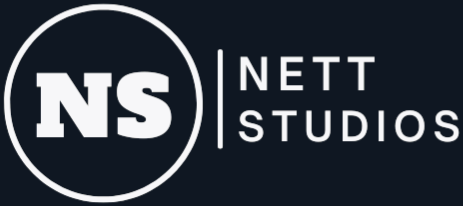

Bem-vindo ao **NettStudios**! Este projeto é um site dedicado a fornecer informações sobre games, incluindo vídeos, notícias e atualizações relacionadas a games. O **NettStudios** foi criado em 2015 como um canal do YouTube, e agora estamos expandindo nosso conteúdo para incluir um site interativo que oferece uma experiência completa para entusiastas de jogos e programação.

Saiba mais sobre os sistemas do NettStudios.

# Overview

Atualmente, o theNettko possui os seguintes sistemas:

- NettStudios:
  - Staging: https://nettstudios-frontend-staging.vercel.app/
   - Development: https://dev-nettstudios-frontend.vercel.app/
    - Web Atual: www.nettstudios.com.br

# Ambientes

Todos os sistemas são compostos de três ambientes:

- Production:
  - Sendo o principal ambiente, é utilizado por todas as pessoas para interagir com o sistema oficial!
- Staging:
  - Antes de entrar para production, as modificações passam pelo ambiente de staging para terem uma validação ou aprovação final.
- Development:
  - Quando novas funcionalidades ficam prontas e são revisadas individualmente, elas ficam no ambiente de development antes de entrarem para o ambiente de staging. Assim, é possível detectar problemas mais rapidamente, antes deles entrarem para o ambiente de production.

# Repositórios

Todos os projetos do theNettko estão hospedados no GitHub, distribuídos nos seguintes repositórios:

- Nettko
  - Web: https://github.com/nettstudioscorp/nettstudios-frontend
     <!-- - Mobile: _Em breve_ -->
    <!-- - Admin
  <!-- - Web: _Em breve_ -->
- Backend: https://github.com/nettstudioscorp/nettstudios-backend
- Documentação: https://github.com/nettstudioscorp/nettstudios-docs
